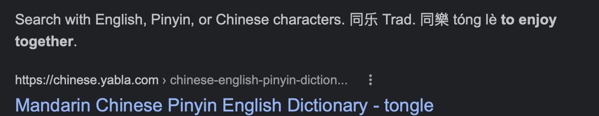

# Tongle Discord Bot

This is a rough readme that I put out in case nothing made sense. *everything* is subject to *any and all* change.

## Personality

Name inspiration. plus the fact that tongue+toggle

## Features

### Message Interception

> The message interception will work until configured to not work. Webhook will do its best to state that it is a translation. Using: https://github.com/nidhaloff/deep-translator

### Direct Command

Using a direct slash command the user will be able to do the following:

-   Translate and get a response from the bot (visible or private)
-   Translate with imitation webhook
-   "Out of mouth translation" = user's messages will be intercepted and resent as translated messages
<!-- 
### _Voice Channel Translation (Self-host or paid only)_

_Using a voice channel, the bot can translate anything it hears from a user into the desired user’s language._ -->

## Configurations

-   User default output language
-   user auto translate on or off
-   server enable or disable
-   user’s preferred translation source.
-   slight customization to their imitation profile.
